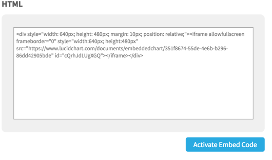

## Evernote

1. On your note go to share->copy public link. paste the link into a new browser.
2. When it redirects you it will give a new link url. copy that and paste it into src for the iframe.
3. Add `.html` to the end of the new url in src.

**Example**
```html
<iframe width="100%" height="600px"  
  frameborder="0"
  src="https://www.evernote.com/shard/s5/sh/36116d20-c2cd-4b37-a5f3-a31df9152aab/84e7853122efc0d7.html">
</iframe>
```

<iframe width="100%" height="600px" frameborder="0"  src="https://www.evernote.com/shard/s5/sh/36116d20-c2cd-4b37-a5f3-a31df9152aab/84e7853122efc0d7.html">
</iframe>

## Onedrive Embed

The quick and easy method is all that works now.

1. In a browser go to your https://onedrive.live.com and right click on the Excel file and then select embed.
2. Click 'generate' button.
3. At bottom of panel click `Customize how this embedded workbook`.
4. In new window copy the `iframe` or the `javascript` or tab next to "Embed Code" above the textbox.

**simple ifram example**

```html
<iframe width="402" height="346" frameborder="0" scrolling="no" src="https://onedrive.live.com/embed?resid=F4E541E7F8747E1B%21395&authkey=%21AAg4KxjLcMu-9W0&em=2&wdAllowInteractivity=False&wdHideHeaders=True&wdInConfigurator=True"></iframe>
```

Will render as follows ...

<iframe width="402" height="346" frameborder="0" scrolling="no" src="https://onedrive.live.com/embed?resid=F4E541E7F8747E1B%21395&authkey=%21AAg4KxjLcMu-9W0&em=2&wdAllowInteractivity=False&wdHideHeaders=True&wdInConfigurator=True"></iframe>


And the javascript is a bit cleaner and you can tweak settings
```html
<div id="myExcelDiv" style="width: 600px; height: 420px"></div>
<!-- * This code uses the Microsoft Office Excel Javascript object model to programmatically insert the
	 * Excel Web App into a div with id=myExcelDiv. The full API is documented at
	 * https://msdn.microsoft.com/en-US/library/hh315812.aspx. There you can find out how to programmatically get
	 * values from your Excel file and how to use the rest of the object model. -->
<script type="text/javascript" src="https://onedrive.live.com/embed?resid=F4E541E7F8747E1B%21395&authkey=%21AAg4KxjLcMu-9W0&em=3&wdDivId=%22myExcelDiv%22&wdHideHeaders=1&wdAllowInteractivity=0"></script>
```
<div id="myExcelDiv" style="width: 600px; height: 420px"></div>
<!-- * This code uses the Microsoft Office Excel Javascript object model to programmatically insert the
	 * Excel Web App into a div with id=myExcelDiv. The full API is documented at
	 * https://msdn.microsoft.com/en-US/library/hh315812.aspx. There you can find out how to programmatically get
	 * values from your Excel file and how to use the rest of the object model. -->
<script type="text/javascript" src="https://onedrive.live.com/embed?resid=F4E541E7F8747E1B%21395&authkey=%21AAg4KxjLcMu-9W0&em=3&wdDivId=%22myExcelDiv%22&wdHideHeaders=1&wdAllowInteractivity=0"></script>

## Lucid

open the Lucid chart and select the share -> embed menu item. click the `activate embed code` and copy and past the HTML.



> :bulb: its recomended to change the width to 100% and remove the margin and relative setting under style

```html
<div style="width: 100%; height: 520px;">  
<iframe allowfullscreen frameborder="0"
style="width:100%; height:520px"
src="https://www.lucidchart.com/documents/embeddedchart/ee9393c4-427d-4390-97da-1d0a42b5823e"
id="n8kd1lbHuhin">
</iframe>
</div>
```

<div style="width: 100%; height: 600px;">
<iframe allowfullscreen frameborder="0" style="width:100%; height:600px" src="https://www.lucidchart.com/documents/embeddedchart/ee9393c4-427d-4390-97da-1d0a42b5823e"
id="n8kd1lbHuhin"></iframe>
</div>

## Embed Snagit

Snagit allows you to upload to screencast as well but uses a more flexible mp4 format.
Instructions are the same but code to copy and paste in is much shorter.

```html
<iframe class="tscplayer_inline embeddedObject" name="tsc_player"
scrolling="no" frameborder="0" type="text/html" style="overflow:hidden;"
src="https://www.screencast.com/users/Greenbill/folders/Snagit/media/f02bf4ee-e4be-44d0-a06e-9a1cda01d005/embed"
height="400" width="1164"
webkitallowfullscreen mozallowfullscreen allowfullscreen>
</iframe>
```

<!-- copy and paste. Modify height and width if desired. -->
<iframe class="tscplayer_inline embeddedObject" name="tsc_player" scrolling="no" frameborder="0" type="text/html" style="overflow:hidden;" src="https://www.screencast.com/users/Greenbill/folders/Snagit/media/f02bf4ee-e4be-44d0-a06e-9a1cda01d005/embed" height="400" width="1164" webkitallowfullscreen mozallowfullscreen allowfullscreen></iframe>

Snaggit is also much more flexible since it uses mp4 which is an html5 standard.
This is the same video and is check into this doc's github (its a small example).

```
<video width="320" height="240" controls>
<source src="../../images/example-snaggit.mp4?dl=0" type="video/mp4">
</video>
```

<video width="320" height="240" controls>
<source src="../../images/example-snaggit.mp4?dl=0" type="video/mp4">
</video>

if you save it to dropbox or onedrive you would reference it like this.

> :bulb: note how the `www.dropbox` part in the url is replaced with `dl.dropboxusercontent`

```
<video width="320" height="240" controls>
<source src="https://dl.dropboxusercontent.com/s/up7k0vasnd3r1pn/2017-07-16_12-07-55.mp4?dl=0" type="video/mp4">
</video>
```
